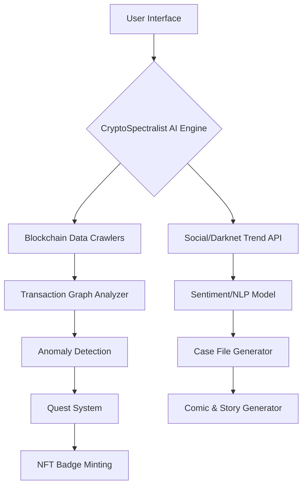

# GhostChain 🔍👻  
**Unmasking Blockchain’s Hidden Realms with AI-Powered Paranormal Investigations**  
*"Where on-chain sleuthing meets supernatural storytelling."*  

---

## 🚀 Overview  
**Problem**  
Blockchain forensics tools are powerful but *dry*, *technical*, and intimidating to everyday users. Meanwhile, illicit activities like mixer transactions and darknet markets lurk in plain sight.  

**Solution**  
GhostChain transforms on-chain analysis into an addictive paranormal detective game. Hunt "ghost transactions," decode darknet trends, and earn NFT badges—all while learning real blockchain forensic skills.  

---

## ✨ Core Features  

### 🕵️♂️ **CryptoSpectralist AI Agent**  
- A snarky AI persona that scours blockchains for "supernatural" activity (mixers, tornado cash, darknet patterns).  
- Generates case files with humorously eerie narratives (e.g., *"The Phantom of Mt. Gox: A Whale’s Revenge"*).  

### 🎮 **Gamified Quests**  
- **Bounty Hunts**: Track suspicious wallets (e.g., "Find the Silk Road relic hidden in this UTXO").  
- **Puzzle Challenges**: Decode encrypted mempool transactions or trace cross-chain money trails.  
- **Leaderboards**: Compete for "Spectral Sleuth" rankings and NFT rewards.  

### 📜 **Comic-Style Explainer Series**  
- **"Tales from the Darknet"**: Visual stories breaking down real-world hacks, scams, and heists.  
- **"Ghost Transactions 101"**: Satirical guides to privacy tools (e.g., *"How to Spot a Zombie CoinJoin"*).  

---

## 🧠 Architecture  



### Key Components  
1. **AI Engine**  
   - **Layers**: NLP for transaction analysis, clustering algorithms to group "ghost" addresses.  
   - **Tools**: Python, TensorFlow, The Graph Protocol for on-chain queries.  
2. **Quest System**  
   - Smart contracts (Solidity) track user progress and trigger NFT rewards.  
   - Chainlink oracles verify real-world task completion (e.g., "Found 5 mixer-linked addresses").  
3. **Comic Generator**  
   - Auto-generates panels using AI (Stable Diffusion + custom storytelling logic).  
   - Hosted on IPFS for decentralized access.  
4. **Data Sources**  
   - Chainalysis-like datasets, Etherscan API, and darknet market scrapers (Tor).  

---

## 🌟 Why Build GhostChain?  

- **For Normies**: Learn blockchain forensics through humor and gamification.  
- **For Devs**: Experiment with AI/ML models in a creative, open-source environment.  
- **For Crypto**: Expose risks in privacy tools while making transparency *fun*.  

---

## 🔮 Roadmap  

| Phase  | Goal                                  |  
|--------|---------------------------------------|  
| 1️⃣     | MVP: Ethereum mixer detection + basic quests |  
| 2️⃣     | Expand to Bitcoin/UTXO chains + comic generator |  
| 3️⃣     | Launch "Spectralist DAO" for community-driven cases |  
| 4️⃣     | Cross-chain NFT badges (Polygon, zkSync) |  

---

## 👻 Call to Action  
**"Become a GhostChain Agent"**  
- 🎨 **Designers**: Help create our comic art style!  
- 🤖 **AI/ML Engineers**: Train the CryptoSpectralist to detect new "paranormal" patterns.  
- 🛠 **Solidity Devs**: Build quest logic and NFT reward systems.  

**Join the Hunt:**  
[](https://discord.gg/ghostchain)  
[](https://github.com/ghostchain)  

---

## 📜 License  
GhostChain is **MIT Licensed**—hack, fork, and summon your own spectral agents!  

*"In the blockchain’s shadows, truth hides… but never for long."* 🔗👻  
```

---

